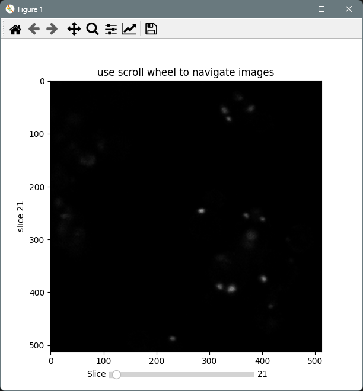
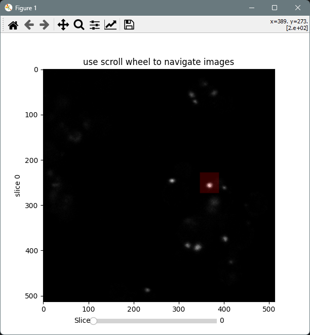
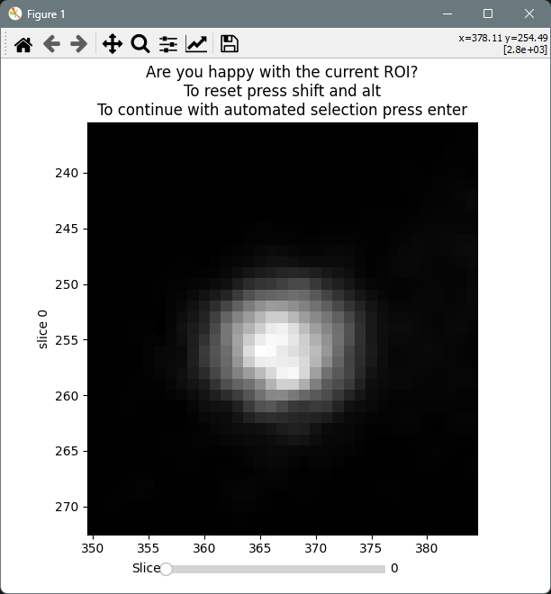
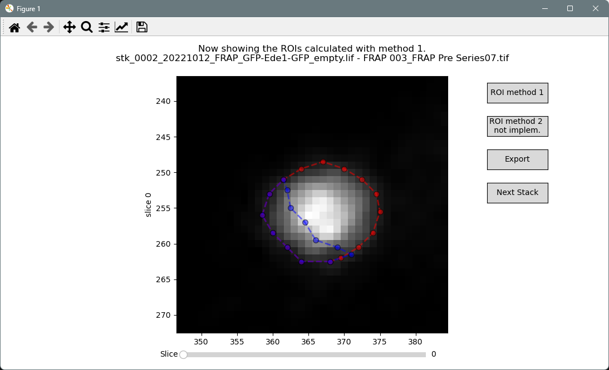
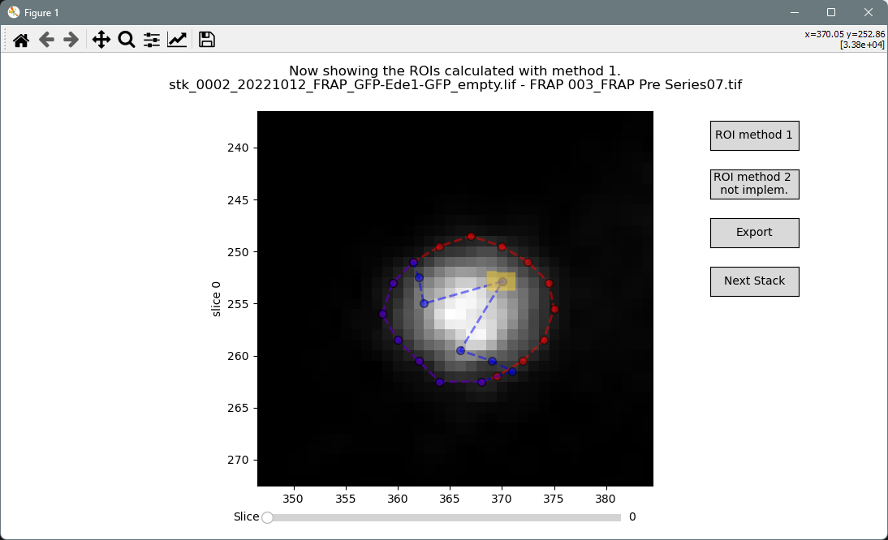

# FRAP-Processing

This script should be running out-of-the-box from the [conda environment](#install-conda-environment) described below. Open the [main notebook](main-notebook.ipynb) in a code editor of your choice or by opening a terminal and running ```jupyter notebook```. In case you have any remaining questions, please don't hesitate to contact jbrenner@biochem.mpg.de or the Wilfling Group at the Max-Planck-Institute of Biophysics. 
Please consider also citing the script with the paper soon to be published by Licheva*, Pflaum*, Babic*, Manchilla* et al.

## The processing workflow
In order to process your FRAP-experiments in batch, we need a folder with single TIFF-stacks (tyx) per position. The notebook will loop through every of these positions and let you semi-automatedly process each stack. If you acquired your data on a Leica microscope and therefore have data in the LIF-format, you can use the ImageJ macro [StackSplitter.ijm](StackSplitter.ijm) to extract single TIF-stacks.

### 1. Zooming the extents of the bleached area
In the first window, you are prompted to zoom the ROI into the viewer by [left mouse] and dragging. To detect the ROI, you can loop through the timeseries with the [mouse wheel] or by dragging the slider under the window. Resetting the ROI works with [shift]+[alt], while the ROI is accepted by pressing [enter].
| Before Bleach|  After Bleach |
| :---: | :---: |
|   |  |

| Before selection of punctum | After selection of punctum |
| :---: | :---: |
|   |  |

### 2. Segmenting the bleached and unbleached area
Next, the program will automatically detect the punctum and segment it into _bleached_ and _unbleached_ area. This can be adjusted by dragging the vertices of the ROIs to the desired location. Holding the [shift] and dragging an edge moves all of the vertices. The ROI can be reset by clicking __ROI Method 1__ again.
| Segmentation |  Adjusted segmentation |
| :---: | :---: |
|   |  |

### 3. Export and continue
 Once __EXPORT__ is pressed, an excel file with the same name as the stack is created. The format looks like this:

| Timepoints | Area(all) |	Mean_intensity(all)	| Area(bleached) |	Mean_intensity(bleached) |	Area(unbleached) |	Mean_intensity(unbleached) | Single Normalization | Double Normalization|
|---|---|---|---|---|---|---|---|---|
|0||||||||
|...||||||||
|End||||||||

To continue stack processing, click __Next Stack__. It will also remind you if you forgot to export your latest ROIs. In case you would like to abort processing, just close the window as usual.


## Install conda environment
In case, you havent installed "conda", download the latest miniconda version: https://docs.anaconda.com/free/miniconda/

After installing, open a terminal, move to a desired installation location, download the repository and create an environment. Before every use, make sure to activate the enviroment accordingly.
```sh
## To clone this repository:
git clone https://github.com/CraignRush/FRAP-Processing.git YOURFOLDERNAME

## Create a new environment for the processing
conda env create --name frap-processing --file=environment.yml

# To activate this environment, use
conda activate frap-processing

## To deactivate an active environment, use
conda deactivate
```


# Not sure, if still needed:
## Specific Prequisties for Mac-Users

- Install the lastest XQartz X11 server and run it

* Activate the option ‘[Allow connections from network clients](https://blogs.oracle.com/oraclewebcentersuite/running-gui-applications-on-native-docker-containers-for-mac)’ in XQuartz settings
* After installation, open `Preferences > Security` and make sure both boxes are checked.
* Quit & restart XQuartz (to activate the setting)
* Open `System Preferences > Network`. You can find your ip address here.
* Open a CMD window and execute

  ```shell
  xhost +
  set-variable -name DISPLAY -value 10.39.0.21:%your_display_number%.0

  ```

## Specific prequisites for Windows users

(from the instructions under [https://dev.to/darksmile92/run-gui-app-in-linux-docker-container-on-windows-host-4kde](https://dev.to/darksmile92/run-gui-app-in-linux-docker-container-on-windows-host-4kde))

* Install [VcXsrv Windows X Server](https://sourceforge.net/projects/vcxsrv/)
* Start XLaunch from the start-menu (as admin)
* Select _Multiple Windows_
* Select a desired _Display Number_
* Select _Start no client_
* Tick all boxes
* Save configuration under C:/User/_youruser_
* Open the PowerShell
* Get your internet IP of your PC via

  ```
  ipconfig
  ```

  * you'll probably see something like: IPv4-Adresse.... 10.xxxxxxx
* Execute this:
* ```
  set-variable -name DISPLAY -value 10.39.0.21:%your_display_number%.0
  ```

## How to start the docker container

1. Install docker
2. Download the image
   ```
   (docker pull ubuntu:18.0)
   docker pull python:3.9-slim-bullseye   
   ```
3. 
4. Open a command line window
5. Naviagat to the folder {YOUR_PATH_HERE}/docker
6. Build the container by
   ``docker build -t test-model . ``
7. Run the container with
   ``docker run -ti -v "/_pathToYourProcessingStacks:/app_home/data" -e DISPLAY=$DISPLAY test-model``
