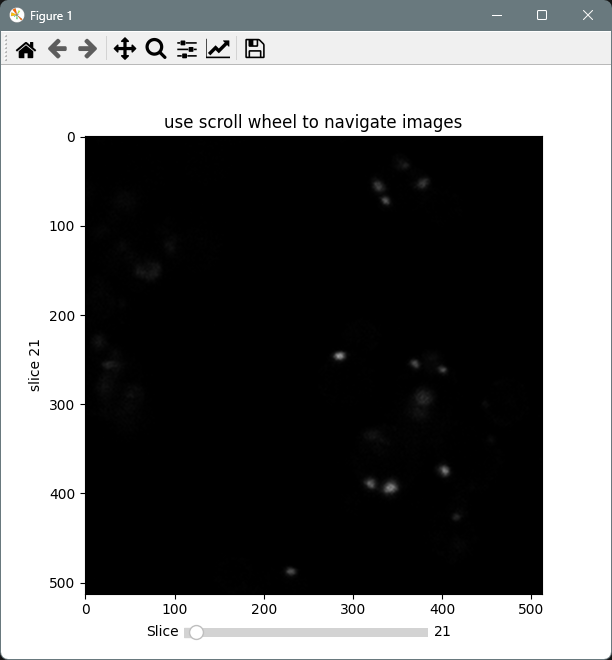
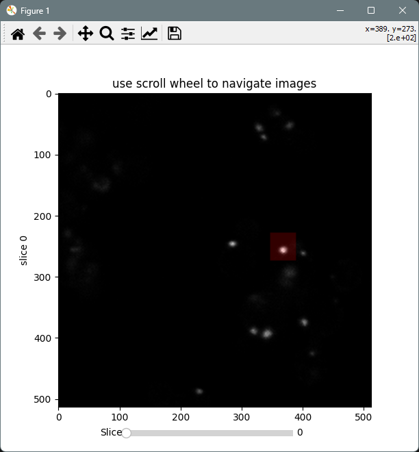
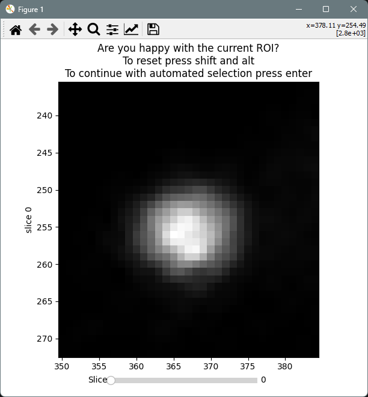
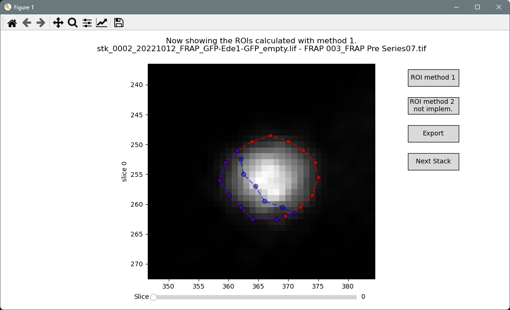
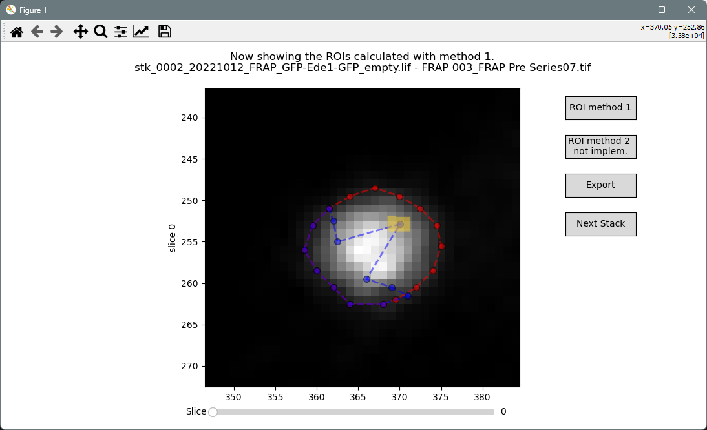

# FRAP-Processing Pipeline

source publication:  
### *Phase separation of initiation hubs on cargo is a trigger switch for selective autophagy*
Mariya Licheva*, Jeremy Pflaum*, Riccardo Babic*, Hector Mancilla*, Jana Elsässer, Emily Boyle, David M. Hollenstein, Jorge Jimenez-Niebla, Jonas Pleyer, Mio Heinrich, Franz-Georg Wieland, Joachim Brenneisen, Christopher Eickhorst, Johann Brenner, Shan Jiang, Markus Hartl, Sonja Welsch, Carola Hunte, Jens Timmer, Florian Wilfling & Claudine Kraft

\* equal contribution  
https://doi.org/10.1038/s41556-024-01572-y](https://doi.org/10.1038/s41556-024-01572-y)

### Abstract
Autophagy is a key cellular quality control mechanism. Nutrient stress triggers bulk autophagy, which nonselectively degrades cytoplasmic material upon formation and liquid–liquid phase separation of the autophagy-related gene 1 (Atg1) complex. In contrast, selective autophagy eliminates protein aggregates, damaged organelles and other cargoes that are targeted by an autophagy receptor. Phase separation of cargo has been observed, but its regulation and impact on selective autophagy are poorly understood. Here, we find that key autophagy biogenesis factors phase separate into initiation hubs at cargo surfaces in yeast, subsequently maturing into sites that drive phagophore nucleation. This phase separation is dependent on multivalent, low-affinity interactions between autophagy receptors and cargo, creating a dynamic cargo surface. Notably, high-affinity interactions between autophagy receptors and cargo complexes block initiation hub formation and autophagy progression. Using these principles, we converted the mammalian reovirus nonstructural protein µNS, which accumulates as particles in the yeast cytoplasm that are not degraded, into a neo-cargo that is degraded by selective autophagy. We show that initiation hubs also form on the surface of different cargoes in human cells and are key to establish the connection to the endoplasmic reticulum, where the phagophore assembly site is formed to initiate phagophore biogenesis. Overall, our findings suggest that regulated phase separation underscores the initiation of both bulk and selective autophagy in evolutionarily diverse organisms.

## Getting started

This script should be running out-of-the-box from the [conda environment](#install-conda-environment) described below. Open the [main notebook](main-notebook.ipynb) in a code editor of your choice or by opening a terminal and running ```jupyter notebook```. In case you have any remaining questions, please don't hesitate to contact jeremy.pflaum@biophys.mpg.de, jbrenner@biochem.mpg.de, or the Wilfling Group at the Max-Planck-Institute of Biophysics. 
Please consider also citing the script with our paper. ([full citation below](#please-cite-us-if-you-are-using-our-script))

## The processing workflow
In order to process your FRAP-experiments in batch, we need a folder with single TIFF-stacks (tyx) per position. The notebook will loop through every of these positions and let you semi-automatedly process each stack. If you acquired your data on a Leica microscope and therefore have data in the LIF-format, you can use the ImageJ macro [StackSplitter.ijm](StackSplitter.ijm) to extract single TIF-stacks.

### 1. Zooming the extents of the bleached area
In the first window, you are prompted to zoom the ROI into the viewer by [left mouse] and dragging. To detect the ROI, you can loop through the timeseries with the [mouse wheel] or by dragging the slider under the window. Resetting the ROI works with [shift]+[alt], while the ROI is accepted by pressing [enter].
| Before Bleach|  After Bleach |
| :---: | :---: |
|   |  |

| Before selection of punctum | After selection of punctum |
| :---: | :---: |
|   |  |

### 2. Segmenting the bleached and unbleached area
Next, the program will automatically detect the punctum and segment it into _bleached_ and _unbleached_ area. This can be adjusted by dragging the vertices of the ROIs to the desired location. Holding the [shift] and dragging an edge moves all of the vertices. The ROI can be reset by clicking __ROI Method 1__ again.
| Segmentation |  Adjusted segmentation |
| :---: | :---: |
|   |  |

### 3. Export and continue
 Once __EXPORT__ is pressed, an excel file with the same name as the stack is created. The format looks like this:

| Timepoints | Area(all) |	Mean_intensity(all)	| Area(bleached) |	Mean_intensity(bleached) |	Area(unbleached) |	Mean_intensity(unbleached) | Single Normalization | Double Normalization|
|---|---|---|---|---|---|---|---|---|
|0||||||||
|...||||||||
|End||||||||

To continue stack processing, click __Next Stack__. It will also remind you if you forgot to export your latest ROIs. In case you would like to abort processing, just close the window as usual.


## Install conda environment
In case, you havent installed "conda", download the latest miniconda version: https://docs.anaconda.com/free/miniconda/

After installing, open a terminal, move to a desired installation location, download the repository and create an environment. Before every use, make sure to activate the enviroment accordingly.
```sh
## To clone this repository:
git clone https://github.com/CraignRush/FRAP-Processing.git YOURFOLDERNAME

## Create a new environment for the processing
conda env create --name frap-processing --file=environment.yml

# To activate this environment, use
conda activate frap-processing

## To deactivate an active environment, use
conda deactivate
```

## Please cite us if you are using our script
[Licheva, M., Pflaum, J., Babic, R., Mancilla, H., Elsässer, J., Boyle, E., Hollenstein, D. M., Jimenez-Niebla, J., Pleyer, J., Heinrich, M., Wieland, F.-G., Brenneisen, J., Eickhorst, C., Brenner, J., Jiang, S., Hartl, M., Welsch, S., Hunte, C., Timmer, J., … Kraft, C. (2025). Phase separation of initiation hubs on cargo is a trigger switch for selective autophagy. In Nature Cell Biology. Springer Science and Business Media LLC. https://doi.org/10.1038/s41556-024-01572-y](https://doi.org/10.1038/s41556-024-01572-y)

```
@article{Licheva2025,
  title = {Phase separation of initiation hubs on cargo is a trigger switch for selective autophagy},
  ISSN = {1476-4679},
  url = {http://dx.doi.org/10.1038/s41556-024-01572-y},
  DOI = {10.1038/s41556-024-01572-y},
  journal = {Nature Cell Biology},
  publisher = {Springer Science and Business Media LLC},
  author = {Licheva,  Mariya and Pflaum,  Jeremy and Babic,  Riccardo and Mancilla,  Hector and Els\"{a}sser,  Jana and Boyle,  Emily and Hollenstein,  David M. and Jimenez-Niebla,  Jorge and Pleyer,  Jonas and Heinrich,  Mio and Wieland,  Franz-Georg and Brenneisen,  Joachim and Eickhorst,  Christopher and Brenner,  Johann and Jiang,  Shan and Hartl,  Markus and Welsch,  Sonja and Hunte,  Carola and Timmer,  Jens and Wilfling,  Florian and Kraft,  Claudine},
  year = {2025},
  month = jan 
}
```

## License
This project is licensed under the MIT License - see the [LICENSE.md](LICENSE.md) file for details
